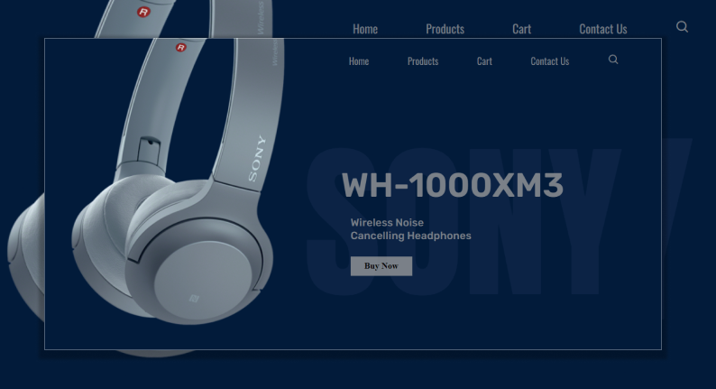

# Product Landing Page 

product landing page using html css and js

### [inspired](https://www.instagram.com/p/CjAiI-dDIsO/)

## [Live Link](https://prasoonmohan-product-landing.netlify.app/)

## Helpers 😍

 - [Product image](https://www.google.com/search?q=sony+headphones+images&sxsrf=ALiCzsbPS5oOUqlzvlMOyWSP00-4I-jWOA:1664380692215&source=lnms&tbm=isch&sa=X&ved=2ahUKEwjjwbif7bf6AhUIAN4KHclHD70Q_AUoAnoECAEQBA&biw=1366&bih=565&dpr=1)
 - [colors](https://colorhunt.co/)
 - [Fonts](https://fonts.google.com/)
 - [Readme](https://readme.so/)

## Snap 😎...

## 🚀 About Me
I'm a full stack developer...

## 🛠 Skills
Javascript, HTML, CSS...

## 🔗 Links

 
